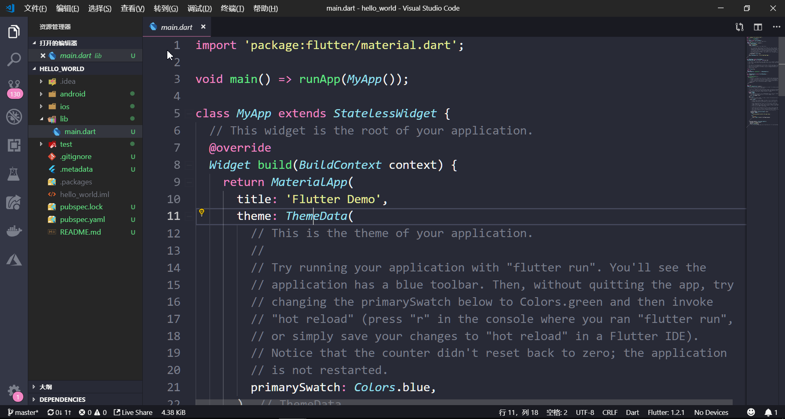

# 创建第一个程序

环境安装完毕后，终于要开始做第一个Flutter的项目了！

在VSCode中使用快捷键 `ctrl + shift + p` 打开命令菜单，输入Flutter搜索相关命令，选择`Flutter: New Project`

输入项目名，需注意项目名必须全小写，连字符使用下划线`_`

选择项目的存放目录，将其放入code目录中

建立完成后会自动打开该项目，初始化项目结构

创建完项目后，如何运行呢？

1. 使用数据线连接一个Android手机（开启adb调试模式，真机调试，开发中常用）
2. 使用Android Virtual Device（Android虚拟设备，又名Android虚拟机、Android模拟器等，简称AVD）

为了学习和截图方便，教程中都会使用AVD

创建AVD，又需要借助Android Studio的帮助啦

打开`Configure` ==> `AVD Manager`

选择创建一个虚拟设备

选择一个自己喜欢的尺寸（建议别太大了，小心撑破屏幕哦）

选择系统镜像（使用哪个版本的Android系统）

由于开始安装Android SDK时并未下载系统镜像，所以此时需要先下载后创建

此处选择最新的正式版系统，Android 9.0 Pie，点击 `Download` 开始下载

耐心等待下载中...

下载完毕后点击 `finish` 

下载完毕后就可以点击下一步了

