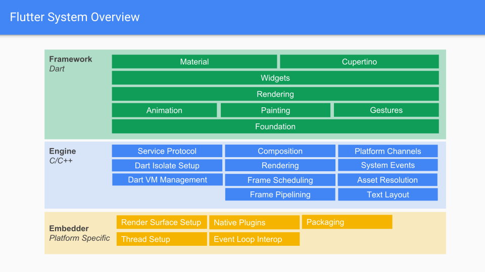
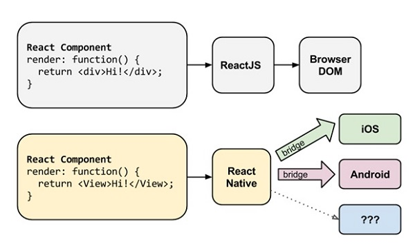

# 主流跨平台框架对比

在了解其他跨平台框架之前，首先得知道为什么需要跨平台框架？它解决了开发中的哪些痛点？

目前主流的移动端应用架构大概分成三类：Native App（原生应用），Web App（移动端网页），Hybrid App（将网页嵌入原生的WebView中）。 

各自的特点如下 ：

- Native App

  - 优点：
    - 性能好
    - 完美的用户体验
  - 缺点：
    - 开发成本高，无法跨平台，Android和iOS需要各自单独开发
    - 升级需审核，维护成本高
  - Native App的性能和用户体验非常好，但是开发维护成本较高，主要受限于一个因素：**钱**  o(╥﹏╥)o 。

  例如微信、QQ等应用

- Web App

  - 优点：
    - 开发成本低，更新快，版本升级容易，自动升级（因为就是网页）
    - 跨平台，Write Once Run Anywhere（养一个前端就够了）
  - 缺点：
    - 无法调用系统级的 API
    - 临时入口，用户留存度低
    - 性能差，体验差，设计受限制
  - Web App体验受限于网络环境、渲染性能、平台特性、浏览器等因素。

  例如直接打开手机浏览器，进入淘宝、京东官网

- Hybrid App

  - 优点：
    - 是Native App 和 Web App 折中的方案，保留了 Native App 和 Web App 的优点。
    - 开发成本低，更新快，无需更新APP即可实现应用升级
    - 跨平台
    - 可以打包成Android的apk和iOS的ipa，直接就是应用
  - 缺点：
    - 性能太差，页面渲染效率低，在 WebView 中绘制界面、实现动画，资源消耗都比较大
  - Hybrid App就是一个原始应用的壳子，里面使用内嵌的浏览器（WebView）访问本地的网页，本质上和Web App并无太大区别，体验受限于网络环境、渲染性能、平台特性等因素

  例如淘宝（即使没有更新淘宝APP，到了双十一打开APP里面也会看到双十一的图标），这也是淘宝早期使用体验不是太好的原因，当然，在阿里技术团队的不断优化下，淘宝在众多Hybrid App中属于一流的性能体验了

为了解决上述问题，一套**高效率**、**高性能**的跨平台方案便成了大家热议的话题，也就有了市面上非常热门的两个解决方案：

- React Native（简称RN）
- Flutter

还有一些其他跨平台框架（weex、cordova、ionic等），由于并不具备**高性能**的条件，所以并未加入其中进行对比。

通过上述信息得出，这一类跨平台框架对性能要求非常高，否则也不至于在出现了这么多解决方案后，Flutter横空出世还能占得上风，归根结底就是因为Flutter主打的亮点就是120FPS高性能渲染，这一特点已经比目前市面上所有的跨平台框架性能要高了！

## Flutter  VS React Native

Flutter框架不同于其他的前端跨平台框架，它是直接采用Dart语言进行开发，构建的应用无需经过JS的解析引擎进行处理，直接基于C/C++的引擎，性能和原生应用接近

RN框架则是使用React的语法进行开发，通过桥接技术，在应用运行时动态的将JS代码编译成原生视图，应用程序运行在同样运行在原生应用的虚拟机中，但是由于是动态渲染视图，在大量数据列表处理时性能有明显的短板，但是对比大部分跨平台“打包”框架，性能上还是有很大优势的

总结一下，Flutter在性能上有明显的优势，但是需要学习一门新的语言Dart，RN只需要对React.js框架的使用足够了解即可快速上手开发，而且RN是在2015年4月进行开源，但是至今仍未发布v1.0正式版，Flutter在2018年推出Beta版后，同年12月就发布了v1.0正式版，可见Google对其的信心和决心！