# 安装Flutter环境

万事俱备，终于要开动了！

进行Flutter的开发需要先下载[Flutter SDK](https://flutter.dev/docs/development/tools/sdk/archive) (根据自己操作系统的版本选择下载)

将Flutter解压到一个风水宝地，需要注意几点：

* 不要解压到高权限的路径（例如：Windows10的`C:/Program Files`）
* 尽量不要放到中文目录（身为老程序员的迷信）

下载完毕后开始安装步骤：

1. 将其解压至`C:/`

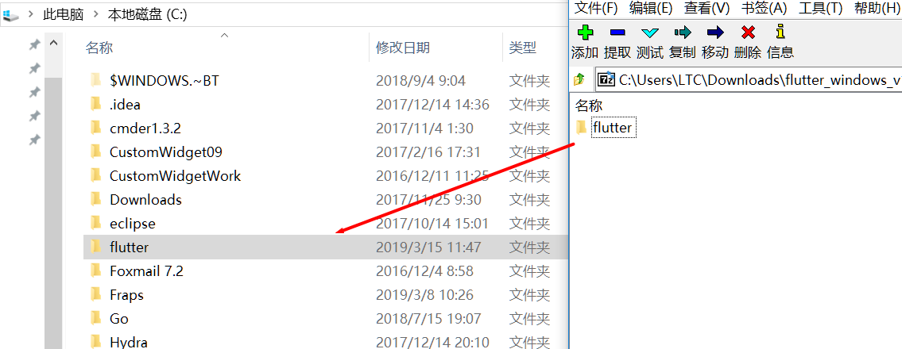

2. 配置path环境变量：将flutter中的bin目录添加到path

> 要在终端运行 `flutter` 命令， 你需要添加以下环境变量到系统PATH：
>
> - 转到 “控制面板>用户帐户>用户帐户>更改我的环境变量”
> - 在“用户变量”下检查是否有名为“Path”的条目:
>   - 如果该条目存在, 追加 `flutter/bin`的全路径，使用 `;` 作为分隔符.
>   - 如果条目不存在, 创建一个新用户变量 `Path` ，然后将 `flutter/bin`的全路径作为它的值.

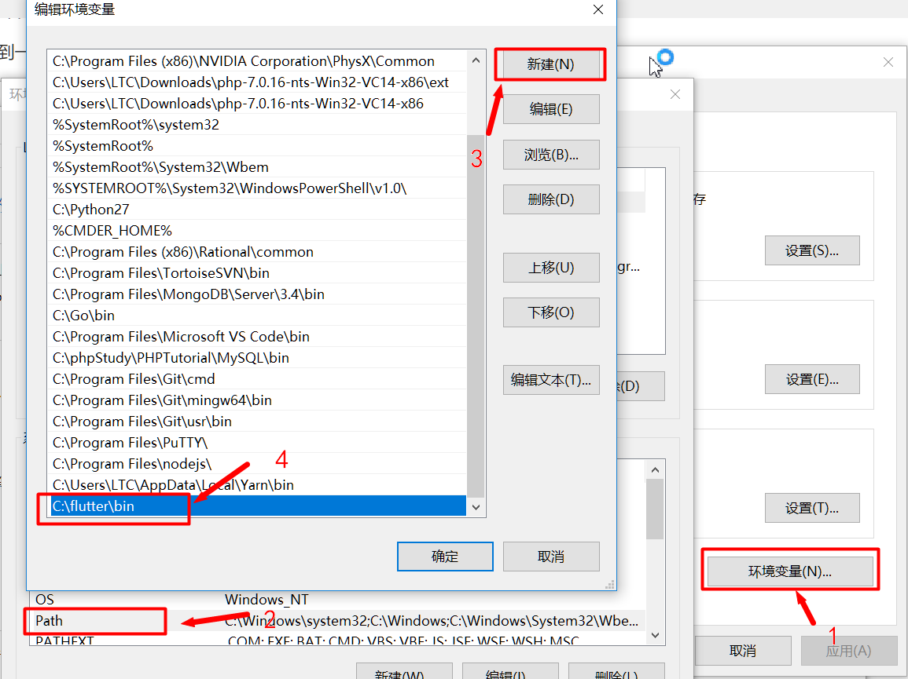

3. 配置完环境变量后即可执行`flutter doctor`指令来诊断flutter环境还需哪些内容

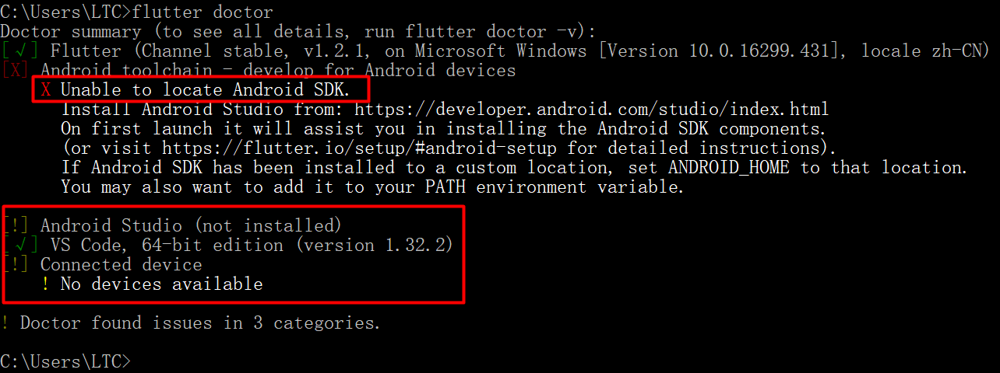

通过上图可以看出flutter的环境需要依赖 `Android SDK` (Android软件开发工具包) 

X表示必须要解决的错误

! 表示建议解决的问题

虽然可以使用 `VSCode` 进行开发，但还是推荐大家安装 `Android Studio` ，因为通过 `Android Studio` 可以快速的下载 `Android SDK`

官方下载地址（中国大陆地区无法打开）：https://developer.android.com/studio

中国大陆搬运站：https://www.androiddevtools.cn

根据自身的操作系统平台，选择对应的Android Studio最新的正式版下载：

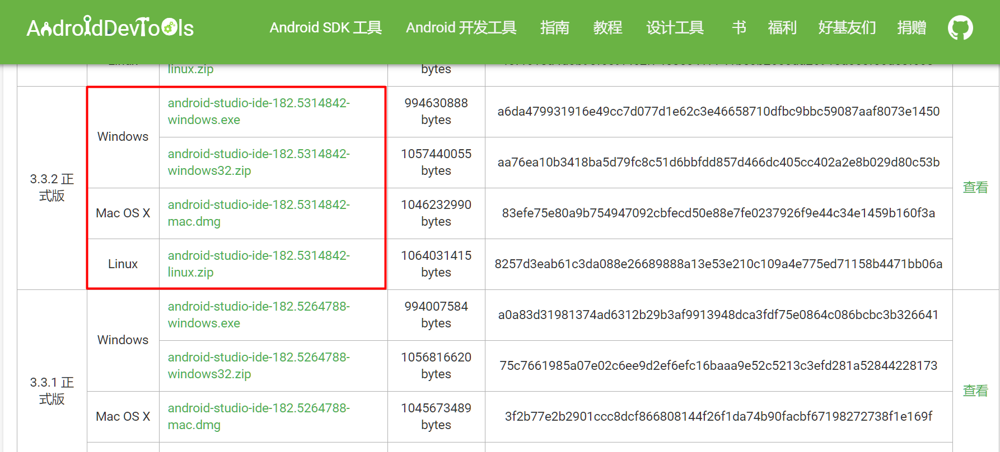

下载安装版就打开exe猛击下一步完成安装，打开安装目录中 `bin/studio64.exe` 或桌面快捷方式运行

下载绿色版就解压到一个风水宝地，找到 `bin/studio64.exe` 运行

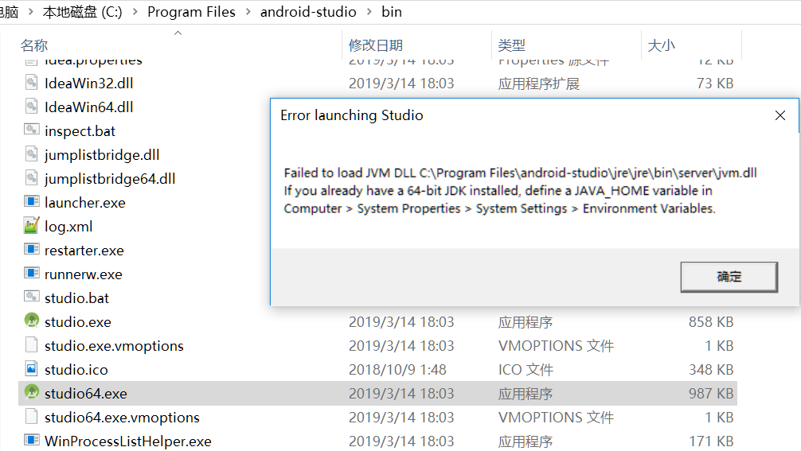

Android Studio 依赖JDK(Java开发工具包)，所以必须安装JDK并配置好环境变量后才可以打开

JDK1.8下载地址：https://www.oracle.com/technetwork/java/javase/downloads/jdk8-downloads-2133151.html

根据自身操作系统平台选择对应的JDK，点击同意协议后下载：

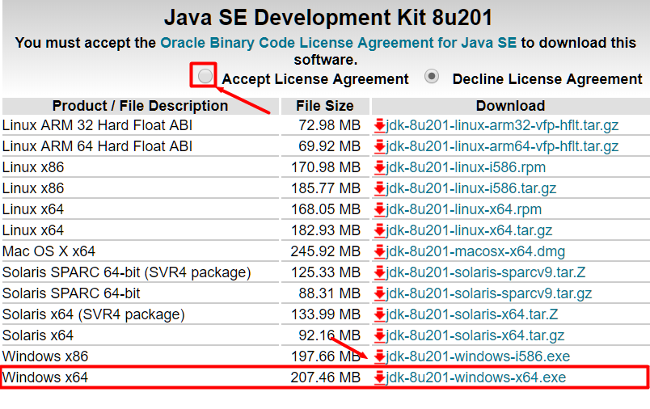

下载完毕打开，猛击下一步选择目录后安装

安装完成JDK后会弹出一个窗口提示安装JRE，直接关闭即可，安装的JDK中已经包含了JRE：

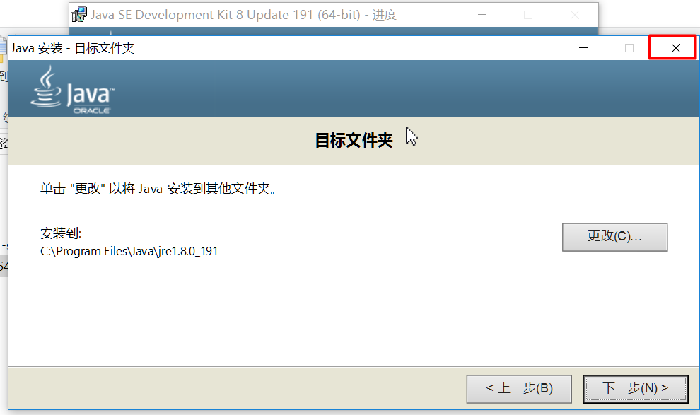

取消完毕后提示JDK安装完成：

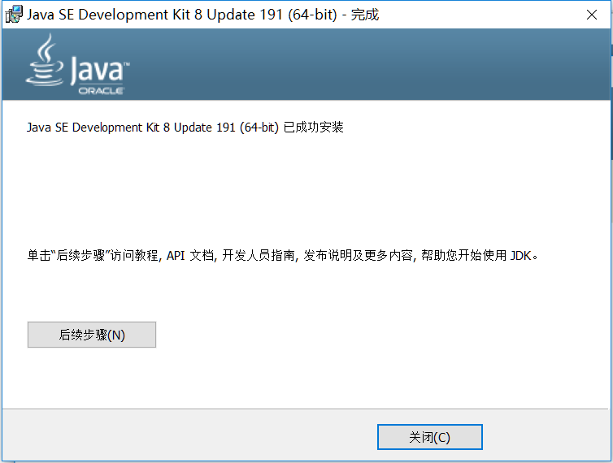

配置JAVA_HOME环境变量：

找到配置PATH变量的地方，注意不是添加到PATH变量中，而是新建一个变量名为JAVA_HOME，将值设置为JDK的安装路径

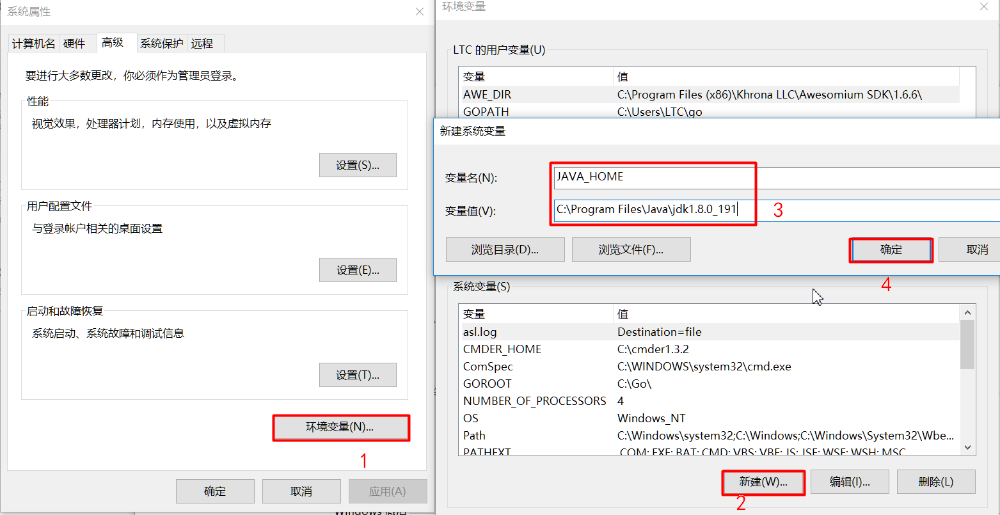

配置完毕后再次打开Android Studio，选择不导入任何设置

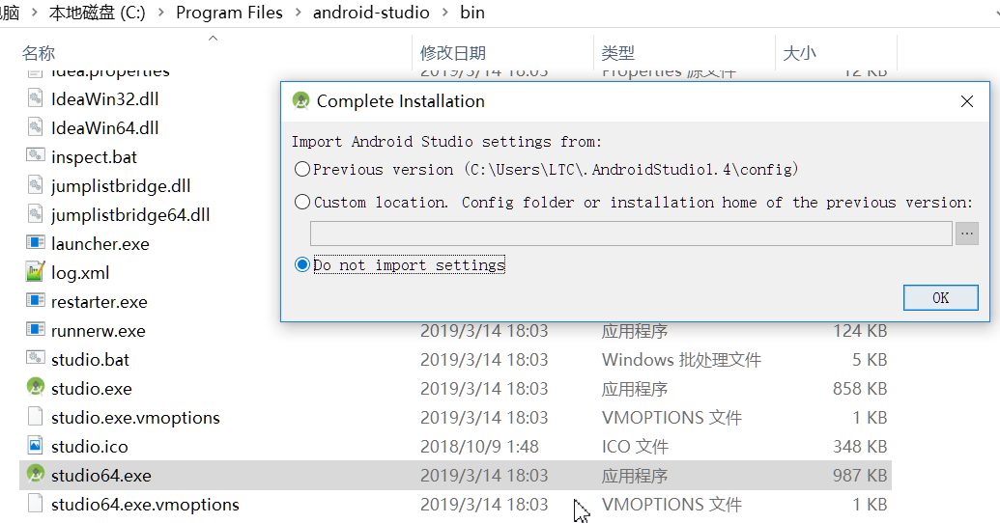

第一次打开会提示无法访问Android SDK（废话，我们的目的就是为了安装SDK）

Android SDK下载服务器不在国内，所以下载速度非常慢

可以选择设置代理，通过国内镜像下载，可以体验飞一般的感觉！

点击 `Setup Proxy`

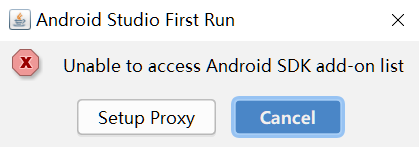

勾选`Auto-detect proxy settings`

输入：**mirrors.neusoft.edu.cn**

同时也可以选择下面的 `Check connection`  来测试该代理是否可用

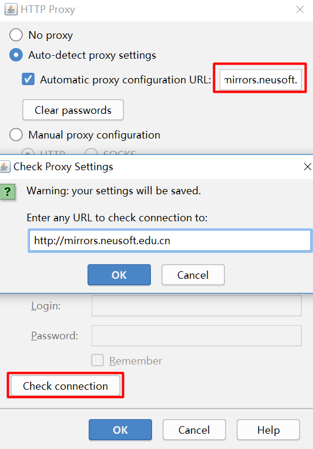

提示 `Connection successful` 连接成功，表示可用

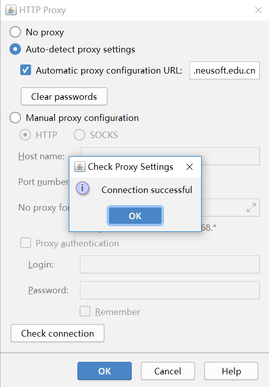

设置完毕代理后会进入一个初始化向导，我们不需要使用Android Studio进行开发，所以可以直接不理会，选择关闭并勾选以后都不要在运行这个向导了

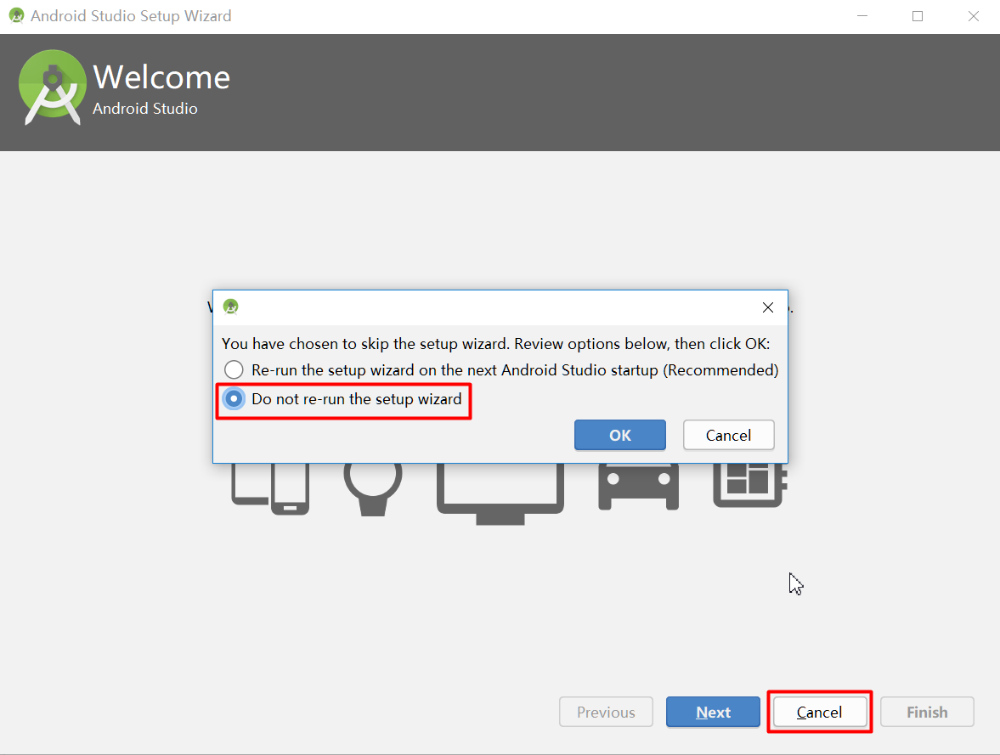

进入熟悉的欢迎界面，点击下方的`Configure` ==> `Settings`

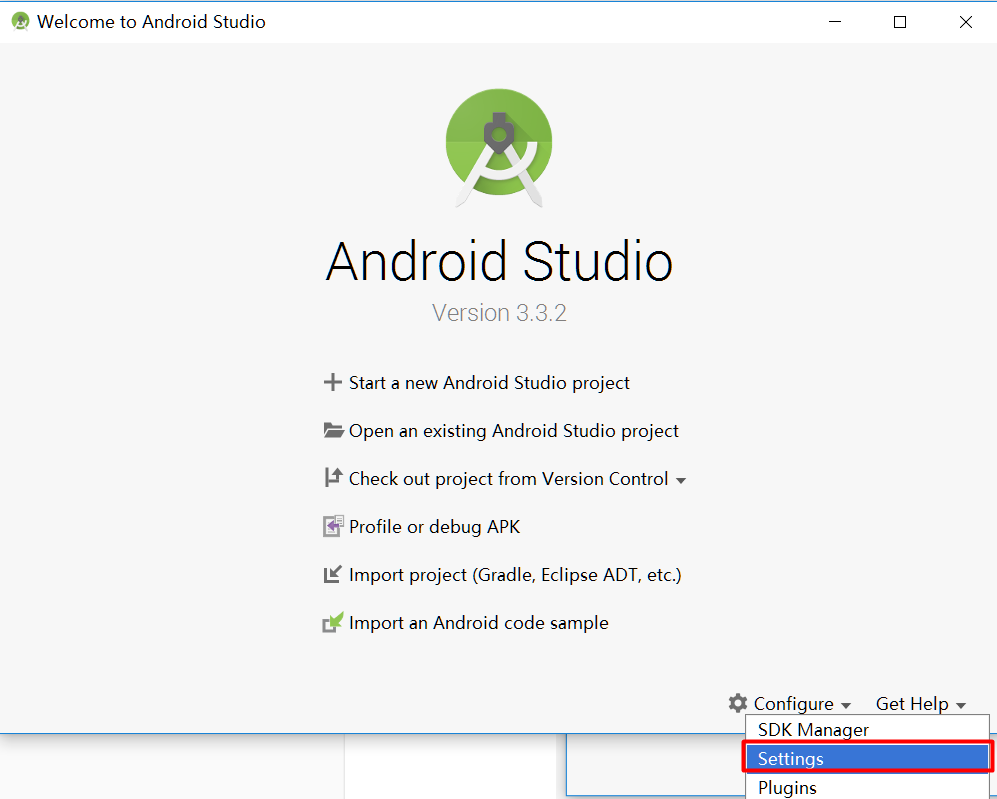

根据图示找到 `Android SDK` 选项

点击 `Edit` 编辑Android SDK的位置

同样选择一个风水宝地

注意：此时选择后就会将Android SDK下载到该目录中

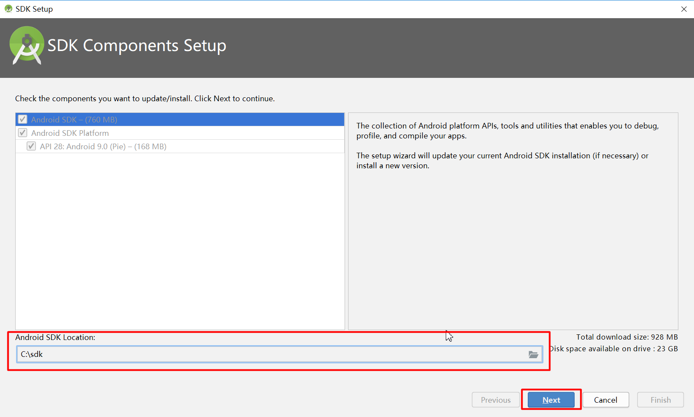

请查收下载清单~

点击下一步后就会开始进行下载

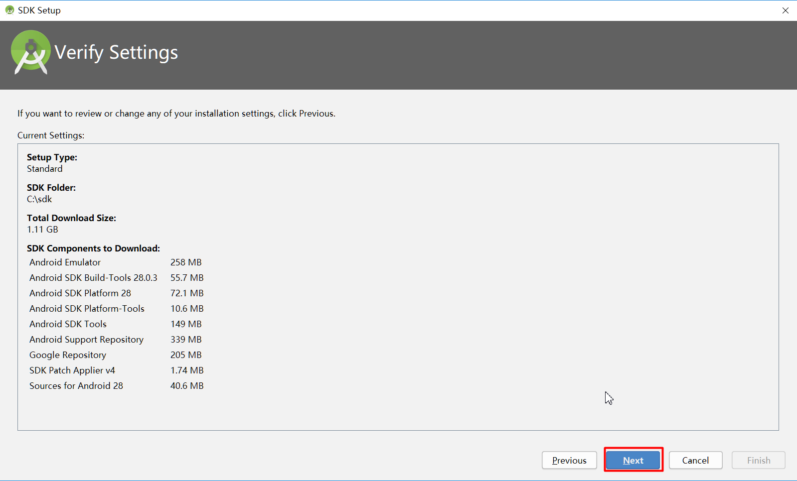

耐心等待一段时间后

下载完成，点击finish

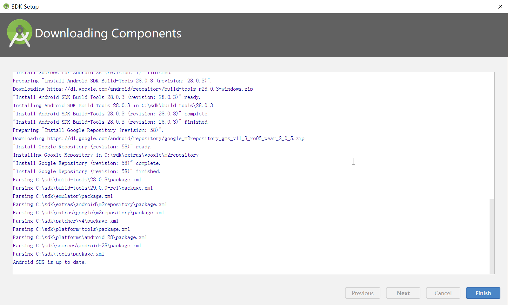

目前只是将最基础的SDK下载完成了，建议勾选其他的工具辅助后期开发

勾选完毕后点击 `Apply` 

注意：当前选中的 `Intel x86 Emulator Accelerator` 是开启Android模拟器的加速器，只有Intel平台的CPU才可以安装使用，安装完成后需要进行内存空间的分配，默认分配2G即可

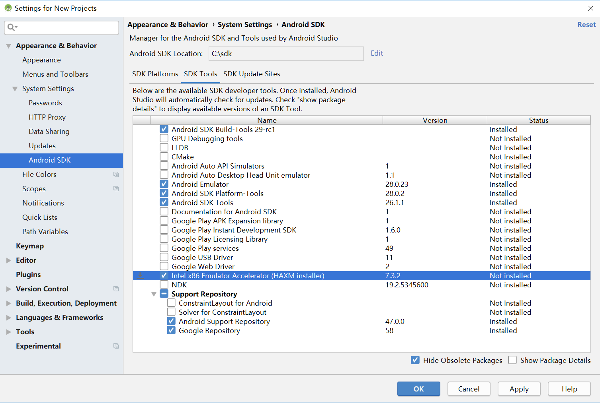

以上所做的一切都是为了下载Android SDK

此时SDK已经下载完毕了，最后只需要将SDK的目录配置到环境变量中即可

步骤同配置JAVA_HOME，将变量名改为ANDROID_HOME，变量值为SDK的路径

配置完毕后重新打开一个终端

再次输入`flutter doctor`

提示Android的协议并未同意，需要执行 `flutter doctor --android-licenses` 命令来同意

运行`flutter doctor --android-licenses`

一路选择y即可

一路选y (共计6个协议)

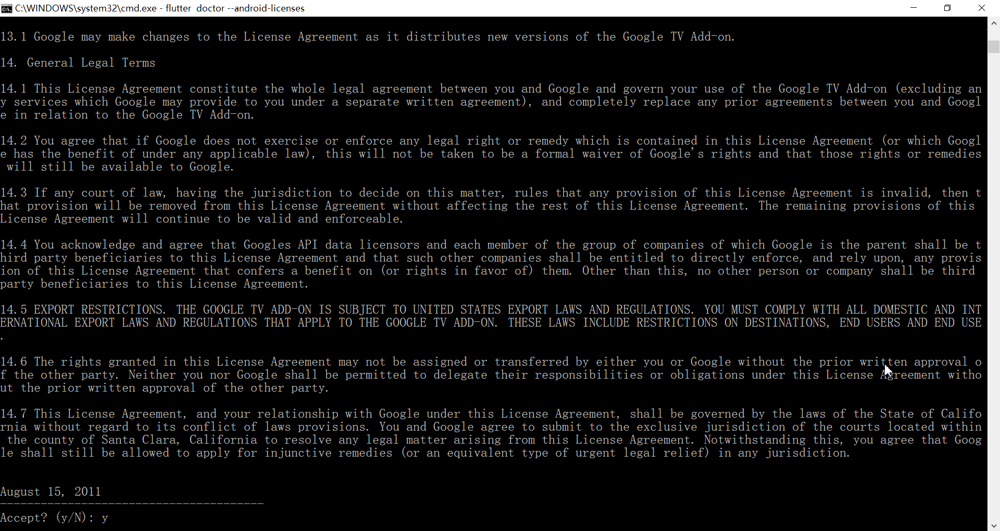

同意所有协议后，再次运行 `flutter doctor`

此时所有的提示都是 `√`

下面关于 `Android Studio` 和 `Connected device` 的两项都是 ! 标识，**不用必须处理**

如果使用Android Studio开发需要安装插件

后期我们选择使用VSCode开发则无需理会

至此关于环境的配置全部完毕！

## 总结

其实Flutter的环境非常简单，但是上面感觉做了好多事情，所以下面来梳理一下

Flutter只需要2个必要的环境：

1. Flutter SDK
2. Android SDK

Flutter SDK安装非常简单，下载后解压，将 `bin` 配置到 `PATH` 环境变量中

当运行 `flutter doctor` 后就会进行环境诊断，此时会提示需要Android SDK

如果本机已经具有Android SDK环境（以前的Android工程师），则所有环境配置完成

但是如果之前从未接触过Android开发，则需要花一点时间进行Android SDK的下载配置，需要几个步骤：

1. 通过Android Studio进行安装会非常快捷
2. 而Android Studio依赖于JDK（Android SDK环境也依赖JDK）
3. JDK的安装和Android SDK的安装都需要配置环境变量，分别是`JAVA_HOME`和`ANDROID_HOME`，与 `PATH` 变量同级
4. 安装配置好JDK后，通过Android Studio进行Android SDK的下载，由于速度较慢，可以设置代理加快下载速度

所以总结就是安装Android SDK，需要借助Android Studio工具，同时需要安装JDK并配置环境变量，最后Android SDK下载完毕后也需要进行环境变量的配置

注意：后期开发学习可以选择使用VSCode，也可以使用Android Studio，两个工具都是官方推荐的，考虑到大部分接触Flutter的用户都是前端工程师，所以后续一切操作都是基于VSCode进行

## VSCode的配置

注意：此章节默认大家已经安装并可以正常运行VSCode，如未安装，请到[VSCode官网](https://code.visualstudio.com)进行下载安装

安装完Flutter后，肯定要开始程序员的第一步：Hello World！

但是，打开VSCode后如何新建项目呢？

需要安装一个Flutter插件

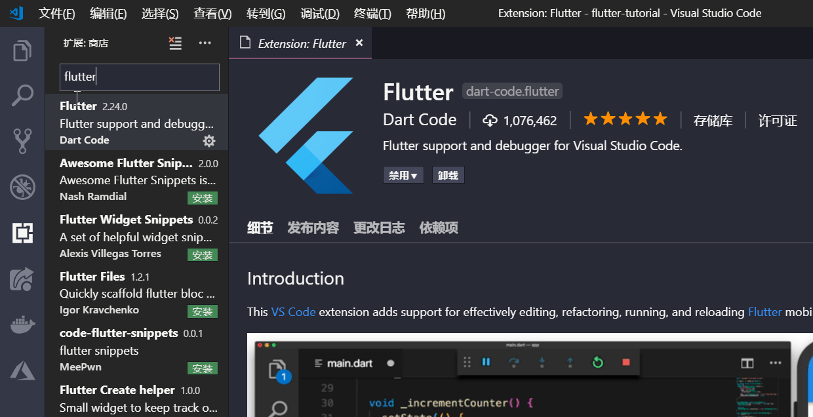

安装完成后，使用快捷键 `ctrl + shift + p` 输入 `flutter` 可以看到创建Flutter项目的选项即表示安装成功

